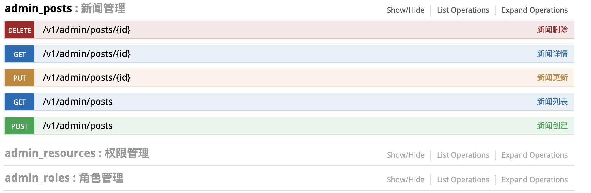

# 说明

这是使用 rails7 api + grape, 来实现前后端分离项目的一个基本脚手架. 用来帮助新手快速的搭建一个 rails 项目.
本仓库尽量保持业务逻辑的简洁, 你可以直接 fork 该项目, 在此基础上直接进行网站的开发.

## 相关插件

- rails 7.0.4.3
- grape 1.7.1
- grape entity 1.0.0
- swagger
- kaminari
- jwt + bcrypt
- mysql2
- rolify
- capistrano
                      
## 项目功能

### 极简 CRUD
主打的就是没有废话, 废代码. 有了这个开发速度提升 1 倍, 可以安心的摸鱼了

```ruby 
# 列表
swagger_desc('get_admin_posts')
get '/' do
  @posts = Post.enabled.page(params.page).per(page_per)
  data_paginate!(@posts, Entities::Post::List)
end

# swagger 文档自动生成
swagger_desc('post_admin_posts')

# 参数校验
params do
  requires :post, type: Hash do
    string_field :title
    text_field :desc
  end
end

# 创建
post '/' do
  @post = Post.create!(declared_params.to_h)
  data_record!(@post, Entities::Post::Detail)
end

route_param :id, requirements: { id: /[0-9]+/ } do
  # 详情
  base.swagger_desc('get_admin_posts_id')
  get '/' do
    data_record!(current_record, Entities::Post::Detail)
  end

  # 修改
  base.swagger_desc('put_admin_posts_id')
  params do
    requires :post, type: Hash do
      string_field :title
      text_field :desc
    end
  end
  put '/' do
    current_record.update!(declared_params.to_h)
    data_record!(current_record, Entities::Post::Detail)
  end

  # 删除
  base.swagger_desc('delete_admin_posts_id')
  delete '/' do
    current_record.disabled!
    data_message!('delete_success')
  end
end
```

### 自动 swagger


## 启动项目
- cp `confg/database.yml.sample` -> `config/database.yml`
- `bundle install`
- `rails start`

## Routes

- 入口: `mount BaseGrape => '/'` , 之后 routes 交由 grape 处理
- 命名: 一般会加版本号到 url 中, 例如 `v1`
- BaseGrape: 封装了一些已知的 Error,  挂载 swagger 和 其他的 grape
- SignGrape: 挂载需要登录的路由
- AdminGrape: 挂载后台路由
- PubGrape: 挂载不需要登录的路由

## SignGrape

- 验证 JWT token
- 验证 Pundit 资源权限
- 设置 PaperTrail

## ParamsValidation

- 会把属性 params 封装为一个对象, 使参数更加可读/清晰. 例如 user[name], user[mobile]
- 单个对象用单数形式, 多个对象用复数形式
- 可以把 params 抽出到 helper 中, 然后用 `use` 方式导入. helper 要 `extend Grape::API::Helpers`

## Entities

对于返回的 model 对象, 用 entities 进行封装, 统一了接口返回, 一般会分为一个完整参数的 entity 和一个只含关键参数的 entity

# ransack

查询参数, 会封装在 q 对象里, 支持 _eq, _in, _cont 字段进行查询, 前端可以在后端不进行参与的情况下, 自己构造检索参数

## HTTP Code

除了 2xx, 5xx 之外, 对 4xx 系列的 http code 进行了具体的区分, 以便前端拿到了 code 后, 进行不同方式的处理

### 401 登录错误

- SignError: 登录失败
- Svc::JwtSignature::SignError: jwt 验证错误

### 403 没有权限

- Pundit::NotAuthorizedError
- PermissionDeniedError: 该用户没有访问此接口权限

### 404 数据不存在

- RecordAlreadyDisabled: 数据已经被删除
- ActiveRecord::RecordNotFound

### 406 验证错误
- ActiveRecord::RecordInvalid
- Grape::Exceptions::ValidationErrors
- RecordCheckInvalid: 字段格式正确, 但是不符合特定的逻辑验证

### 409 数据不允许操作

- AASM::InvalidTransition
- RecordStateError: 数据状态不允许修改
- RecordNotAllowDisabled: 数据不允许删除

### 422 其他错误

## http-store HTTP 请求记录器
- 默认会记录每条 API 的请求
- 配置 application.yml, `config.middleware.use HttpStore::Middleware::RequestLog`
- http_logs 表

## params 为 null 或 '' 或不含此字段问题

这里分两种情况进行讨论

## 更新/新增
- 为 null/'' 时, 代表更新此字段值为 null/''
- 不含此字段, 代表不更新此字段, 保持为原值

## 查询检索
- 为 null/不含此字段, 代表不以此字段进行查询
- 为 '', 代表匹配此字段数值为空的(最新的 ransack 版本, '' 也代表不以此字段进行查询, 这块有争议) 

为了避免不必要的歧义, 在使用 params 时, 部分更新时使用 declared_params 来做参数的调用, 完全更新时使用 full_params.
相应的前端调用时, 最好遵循以上规范

# 保持最新

该项目会一直保持简洁, 你可以时刻关注项目的版本更新以及一些新功能的添加, 必要的时候, 可以把 master merge 到当前仓库中(确定有必要, 以及不会带来不兼容的性的修改).

# 提交新功能 或 bug 修改

您可以直接提 isuue 或 pr 或直接联系我: 308820773(qq微信同号)
